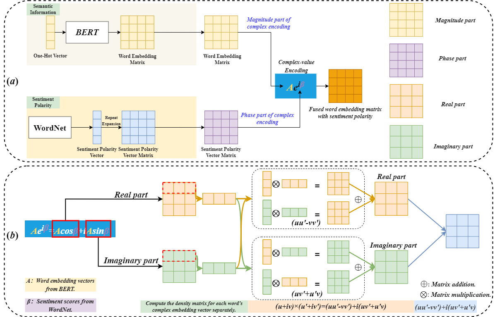

<div align="center"> 

## Quantum-inspired Interpretable Deep Learning Architecture for Text Sentiment Analysis

</div>
<p align="center">
<a href="http://arxiv.org/abs/2408.07891">
    </a>
<a href="https://pytorch.org/">
    </a>
<a href="LICENSE">
    </a>
</p>

## Introduction

Text has become the predominant form of communication on social media, embedding a wealth of emotional nuances. Consequently, the extraction of emotional information from text is of paramount importance. Despite previous research making some progress, existing text sentiment analysis models still face challenges in integrating diverse semantic information and lack interpretability. To address these issues, we propose a quantum-inspired deep learning architecture that combines fundamental principles of quantum mechanics (QM principles) with deep learning models for text sentiment analysis.  Specifically, we analyze the commonalities between text representation and QM principles to design a quantum-inspired text representation method and further develop a quantum-inspired text embedding layer. Additionally, we design a feature extraction layer based on long short-term memory (LSTM) networks and self-attention mechanisms (SAMs). Finally, we calculate the text density matrix using the quantum complex numbers principle and apply 2D-convolution neural networks (CNNs) for feature condensation and dimensionality reduction. Through a series of visualization, comparative, and ablation experiments, we demonstrate that our model not only shows significant advantages in accuracy and efficiency compared to previous related models but also achieves a certain level of interpretability by integrating QM principles.

## 🚀 Updates
- [x] 07/2024: init repository.
- [x] 07/2024: release the code for QITSA.

## 🔍 QITSA model

<div align="center"> 


**Figure:** Illustration of Quantum-Inspired Language Representation.


**Figure:** The Quantum-Mechanics principle word embedding layer.


**Figure:** Overall process framework and detailed structure diagram..

</div>

## Main Results

**Figure:** Real and Imaginary parts after the quantum-inspired information embedding layer. Example 2 can better highlight areas with significant emotional changes while suppressing areas with weak emotional signals.


**Figure:** Comparison of the related models on accuracy across five benchmark datasets.


**Figure:** Ablation experiments on the impact of different embedding data on test accuracy.


**Figure:** Ablation experiments on different dimensionality reduction operations on test accuracy.


## Data preparation
Download the dataset:
All the data output by BERT is released.

Download:
- [WordNet](https://drive.google.com/file/d/1zDPySBmsagwY1jIqzYejOOci-oFe51oe/view?usp=sharing).
And put it in the same location with train.py

Download:
- [DataFormBERT](https://drive.google.com/file/d/1iwY1CcRdRH3WnANpascAj6q9MREkawlU/view?usp=sharing).
Unzip it and put it in the same location with train.py

```

## Model Zoo
All the results in the paper is shown in main_results.

## Training
python train.py


## Evaluation
python test.py
```

## License
This repository is under the Apache-2.0 license. For commercial use, please contact with the authors.


## Citations

**Note:** This is a research level repository and might contain issues/bugs. Please contact the authors for any query.
